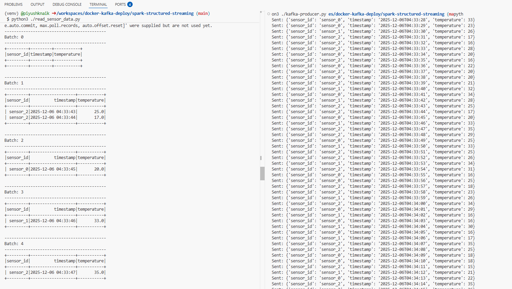

# spark-kafka-structured-streaming
This project demonstrates how to use Apache Kafka and Apache Spark Structured Streaming together. It provides a Docker-based setup for running Kafka and Zookeeper, a Python script to produce random sensor data to a Kafka topic (sensor-data), and a PySpark script to consume and process that data in real time.


## Kafka Setup

1. Start Kafka and Zookeeper using Docker Compose:
	 ```bash
	 docker compose up -d
	 ```
	 This will start Zookeeper on port 2181 and Kafka on port 9092.

2. Ensure the `sensor-data` topic exists (the producer will auto-create it if not present).

## Kafka Producer

- The `kafka-producer.py` script sends random sensor data to the `sensor-data` topic.
- Requirements: `kafka-python`
- Usage:
	```bash
	cd spark-structured-streaming
	python3 -m venv venv
	source venv/bin/activate
	pip install kafka-python
	python kafka-producer.py
	```
- The script sends 100 messages, one per second, with fields: `sensor_id`, `timestamp`, and `temperature`.

## Spark to Read Stream Data

- The `read_sensor_data.py` script uses PySpark Structured Streaming to read from the `sensor-data` Kafka topic and print the results to the console.
- Requirements: `pyspark`
- Usage:
	```bash
	cd spark-structured-streaming
	pip install pyspark
	python read_sensor_data.py
	```
- The script expects the Kafka broker at `localhost:9092` and the topic `sensor-data`.